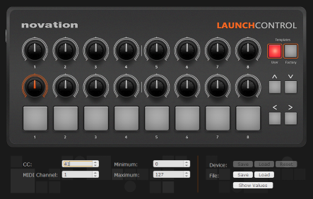

# pLaunchController
A JAVA wrapper for the Novation Launch Controller aimed at using the MIDI pads and knobs as input for Processing sketches.



# Installation
## From Processing editor
In Processing, go to `Sketch`, `Import library...`, `Add library`. Search for "Launch Controller" and once found, click `Install`.
## Manual installation
Copy the file pLaunchController.jar to a folder `code` inside your sketch. This method makes the library available to an individual sketch.
If you intend to make the library available to all sketches, unzip the pLaunchController.zip file to the libraries of your Processing installation (you can see the library in Preferences page).

# Usage
To start using the library, make sure Novation Launch Controller is connected to your computer (at least one led is lit).
## Add reference to library
  1. At the top of your sketch, import the namespace `pLaunchController`:
      ```JAVA
      import pLaunchController.*;
      ```
   
   2. Declare a global variable of type `LaunchController`
        ```JAVA
          LaunchController midiController;
        ```
   3. Instantiate the controller during `setup()`:
   
  ```JAVA
      try {
          midiController = new LaunchController(this);
      }
       catch(Exception e) {
          println("Error connecting to MIDI device! Sketch will run with UI controllers. values.");
          midiController = null;
      }
  ```
  4. Implement one of the following methods in your sketch:
  
     * `void launchControllerKnobChanged(KNOBS knob)`
     
        Called when a knob was changed.
     * `void launchControllerPadChanged(PADS pad)`
     
        Called when you push a pad.
     * `void launchControllerControlChanged()`
     
        Called when either a pad or knob changes.
  
  An example where I use `LaunchController.onKnobChanged(KNOBS knob)` to set a few variables:
   ```JAVA
     void launchControllerKnobChanged(KNOBS knob) {
       println("Launch Control knob changed: " + knob.name());

       //maps r to the value of the first knob
       //getKnobMap() is the same as:
       //r = map(controller.getKnob(KNOBS.KNOB_1_HIGH), 0, 127, 100,500);
       r = controller.getKnobMap(KNOBS.KNOB_1_HIGH,100,500);
       m = controller.getKnobMap(KNOBS.KNOB_2_HIGH,0,100);
       lat_start = controller.getKnobMap(KNOBS.KNOB_3_HIGH,-HALF_PI,0);
       lat_end = controller.getKnobMap(KNOBS.KNOB_4_HIGH,0,HALF_PI);
       lon_start = controller.getKnobMap(KNOBS.KNOB_5_HIGH,-PI,0);
       lon_end = controller.getKnobMap(KNOBS.KNOB_6_HIGH,0,PI);
    }    
   ```
