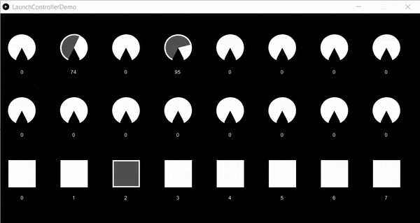

# pLaunchController
A JAVA wrapper for the Novation Launch Controller aimed at using the MIDI pads and knobs as input for Processing sketches.
You can attach knobs to variables, and use the device to control and adjust your animation.

* [Installation](#installation)
* [Quick guide](#quick-guide)
* [Examples](#examples)


 
# Installation
## From Processing editor
In Processing, go to `Sketch`, `Import library...`, `Add library`. Search for "Novation Launch Controller client" and once found, click `Install`.
## Manual installation
Copy the file pLaunchController.jar to a folder `code` inside your sketch. This method makes the library available to an individual sketch.
If you intend to make the library available to all sketches, unzip the pLaunchController.zip file to the libraries of your Processing installation (you can see the default skecthbook location in File -> Preferences).

# Quick guide
To start using the library, make sure Novation Launch Controller is connected to your computer (at least one led is lit).
For more advanced usage, see also [Using events](using-events.md).
## Add reference to library
  1. At the top of your sketch, import the namespace `pLaunchController`:
      ```JAVA
      import pLaunchController.*;
      ```
   
   2. Declare a global variable of type `LaunchController`
        ```JAVA
          LaunchController midiController;
        ```
   3. Instantiate the controller during `setup()`:
   
  ```JAVA
      try {
          midiController = new LaunchController(this);
      }
       catch(Exception e) {
          println("Error connecting to MIDI device! Sketch will run with UI controllers. values.");
          midiController = null;
      }
  ```
  
  4. Attach a knob to a variable in your sketch.
  
  
  5. Optionally, use `range(float minValue,float maxValue)` to override the output of knob values, and `defaultValue(float value)` to set an initial value. By default, knobs will return values from 0 to 127.
    
  ```JAVA
    controller.getKnob(KNOBS.KNOB_1_HIGH).range(10,200).defaultValue(h);
  ``` 
  
# Examples
Once you install the librarie from Processing, you can open the examples
from `File -> Examples... -> Contributed Libraries ->  Novation LaunchController client`.
See below a brief description for each example included.

## LaunchController Demo
Shows the knobs and pads on a sketch. A simple way to test the library and the
connectivity to your LaunchPad.


[Source code](examples/LaunchControllerDemo/LaunchControllerDemo.pde)

## SuperShape
Based on the [original by Daniel Shiffman](https://youtu.be/akM4wMZIBWg), I used
the controller to set the various parameters of the supershape algorithm.


[Source code](examples/examples/SuperShape2D/SuperShape2D.pde)

# Compatibility
The library was developed in Windows 10 and it has been tested with Processing 3.3 
and Processing 3.4 in both Windows 10 and Mac OS 10. If you have trouble using the 
library, please [submit an issue](https://github.com/haschdl/pLaunchController/issues/new). 

# Limitations and further development
The library was developed and tested only the smallest of the Novation controllers, 
Launch Control, which has 16 knobs and 8 pads. If you are interested in using other Novation products please 
[submit an issue](https://github.com/haschdl/pLaunchController/issues/new) and I will
evaluate what can be done. 
                                                                              
