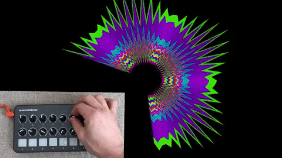

# pLaunchControl

Use your Novation MIDI controllers with Processing. With this library you can connect your Novation MIDI devices
to Processing sketches, using the physical knobs, slides and pads to change variables in the sketch to control
animation, color, position, etc.

In this release, the library supports the devices:
* Novation Launch Control (16 knobs, 8 buttons)
* Novation Launch Control XL (24 knobs, 8 sliders, 16 buttons)

* [Installation](#installation)
* [Quick guide](#quick-guide)
* [Examples](#examples)


# Installation
## From Processing editor
In Processing, go to `Sketch`, `Import library...`, `Add library`. Search for "Novation Launch Control client" 
and once found, click `Install`. If you are having trouble using the Contributor Manager in Processing, you 
can try the [manual installation](troubleshooting.md#manual-installation)


# Quick guide
To start using the library, make sure your MIDI device is connected to your computer (at least one led is lit).
For more advanced usage, see also [Using events](using-events.md).
## Add reference to library
  1. At the top of your sketch, import the namespace `pLaunchControl`:
      ```JAVA
      import pLaunchControl.*;
      ```
   
   2. Declare a global variable of type `LaunchController`
        ```JAVA
          LaunchControl midiController;
        ```
   3. Instantiate the controller during `setup()`:
   
  ```JAVA
      try {
          midiController = new LaunchControl(this);
      }
       catch(Exception e) {
          println("Error connecting to MIDI device! Sketch will run with UI controllers. values.");
          midiController = null;
      }
  ```
  
  4. Attach a knob to a variable in your sketch.
  
  
  5. Optionally, use `range(float minValue,float maxValue)` to override the output of knob values, and `defaultValue(float value)` to set an initial value. By default, knobs will return values from 0 to 127.
    
  ```JAVA
    controller.getKnob(KNOBS.KNOB_1_HIGH).range(10,200).defaultValue(h);
  ``` 
  
# Examples
Once you install the library from Processing, you can open the examples
from `File -> Examples... -> Contributed Libraries ->  Novation Launch Control client`.
See below a brief description for each example included.

## Launch Control Demo
Shows the knobs and pads on a sketch. A simple way to test the library and the
connectivity to your LaunchPad.

  
[Source code](/examples/LaunchControlDemo/LaunchControlDemo.pde)

## SuperShape
Based on the [original by Daniel Shiffman](https://youtu.be/akM4wMZIBWg), I used
the controller to set the various parameters of the super shape algorithm.

  
[Source code](/examples/SuperShape2D/SuperShape2D.pde)

# Compatibility
The library was developed in Windows 10, and it has been tested with Processing 3.4 
and Processing 4 in both Windows 10 and macOS 10. If you have trouble using the 
library, please [submit an issue](https://github.com/haschdl/pLaunchControl/issues/new). 

# Limitations and further development
The library was developed and tested only two of the Novation controllers, 
Launch Control and Launch Control XL. If you are interested in using other Novation products please 
[submit an issue](https://github.com/haschdl/pLaunchControl/issues/new), and I will
evaluate what can be done. 
                                                                              
